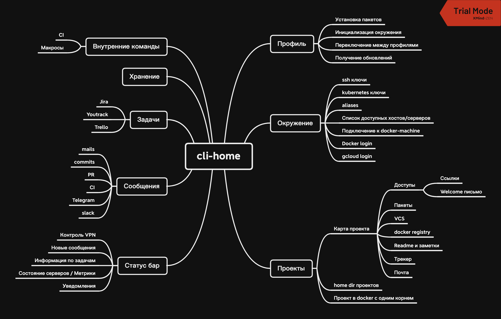

# Управление интерфейсом командной строки

- Синхронизировать настройки между разными рабочими станциями
  - /etc/hosts
  - ssl Ключи от внешних сервисов
  - alias
  - Переменные окружения
- Каталогизировать настройки (профили) для разных типов компьютеров (сервер, сервер под язык, персональный интерфейс)
- Переключение между профилями через командную строку
- Хранение пакетов, которые нужно поставить для разных OS
- Возможность хранения закрытых паролем переменных окружения
- Хранение backup конфигов и быстрое восстановление при аварии
- Автоматическое обновление профиля при старте командной оболочки
- Работа с трекерами задач: Получение информации о задачах в консоль, интерактив с задачами
- Мастер ключ для доступа к серверам
- Синхронизация репозиториев
- Статус бар общий по профилям и по конкретному провилю
- Контроль времени за работой (На каком профиле и сколько времени потрачено)
- Удаление проектов локально, если удаленный репозиторий удален

[IEEE Std 1003.1-2017](https://pubs.opengroup.org/onlinepubs/9699919799/basedefs/V1_chap12.html)

## Установка cli-home

`wget <URL релиза> /usr/local/lib/c/`

`ln -s /usr/local/lib/c/c.sh /usr/local/bin/c`

`c install`

`c status`

## Работа с окружениями

`с env install` // Установить окружение

## Конфигурция окружения

`c zsh plugin install <название плагина>`

`c vim plugin install  <название плагина>`
